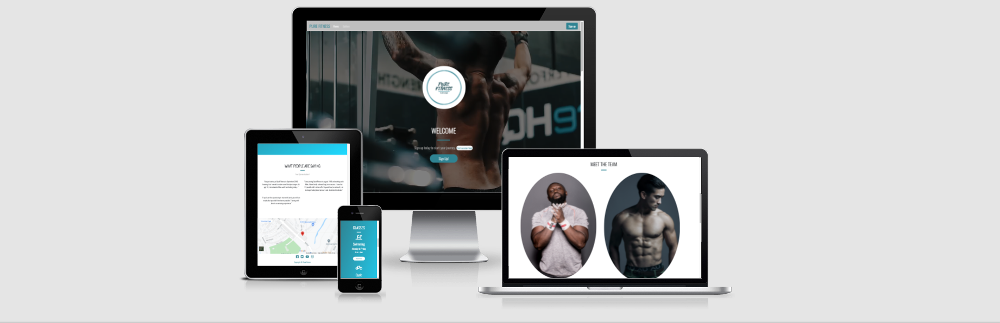

# Pure Fitness Gym Website

[View live project here](lukesmallman.github.io/pure-fitness/)

<h2 align="center">

This is a website for the pure fitness gym website, a fictional fitness centre offering gym memberships and a variaty of classes to choose from. It is designed to be responsive on different devices, making it easy to navigate for existing members and also people who are looking to sign up for the first time..

The website provides users with information about the process for joining classes, where to locate the gym, instructor biographies and a downloadable timetable.

# Contents

- [1. User Experience (UX)](#1-user-experience-ux)
- [2. Features](#2-features)
- [3 Technologies Used](#3-technologies-used)
- [4. Testing](#4-testing)
- [5. Deployment](#5-deployment)
- [6. Credits](#6-credits)
  

# 1. User Experience (UX)

## 1.1 Target audience

- People looking to start their journey with us,
- Members to look what classes are available.

## 1.2 User Stories

### First Time Visitor Goals

  1. As a First Time Visitor, I want them to easily navigate through the website and understand the main purpose of the site and also learn more about what we do at pure fitness.

  2. As a First Time Visitor, I want to be able to easily navigate throughout the website to find more information about where each fitness center is located and also contact infomation.

  3. As a First Time Visitor, I want to be able to easily navigate throughout the website to find out more infomation about the instructors that work at pure fitness, ensuring that I choose the right one for me.

  4. As a First Time Visitor, I want to be able to easily navigate throughout the website to find more information about what people are saying about the fitness center and it's people.

  5. As a First Time Visitor, I want to locate social media links to see the pure fitness social presence and find some images of the classes and equipment used.
  
### Returning Visitor Goals
  
  6. As a Returning Visitor, I want to find out how to book a class and what time they are.

  7. As a Returning Visitor, I want to store all my infomation and the things that interest me so it is easier for me to navigate to these.

  8. As a Returning Visitor, I want to find information about prices and buy additional class bundles.

### Frequent User Goals
  
  9. As a Frequent User, I want to check what classes are happening and the time/dates of these classes.

  10. As a Frequent User, I want to be able to view changes to the timetable and new classes becoming available.

  11. As a Frequent User, I want to be the first to found out about new classes.

  12. As a Frequent User, I want to sign up to newsletter so I don't miss a thing.

## 1.3 Design

### Colour Scheme

- The two main colors used are Blue and Grey. As you can see from the link these are peaceful and sophisticates colors "Color sychology chart" ([link](https://www.tailwindapp.com/blog/color-psychology-in-marketing))

### Typography

- The Oswald font was the main font used through out my website with Sans Serif as a backup just in case for any reason the font diden't load. I chose Oswald as its easy to read and it's clean and attractive to the eye.

### Imagery/Videos

- To catch the eye of the viewers I opt for a large video that displays a fitness montage.

- I used a variety of images in the gallery section as I wanted to show the equipment and also people training so it encourages people to stay on the website and explore more.

## 1.4 Structure

- During my research i visited many fitness websites to find a common theme and also what features they had;
  - Timetables
  - Class descriptions
  - Class rates, and bundle packages
  - Facilities and equipment
  - Social media links, most commonly Facebook, Twitter and Instagram
  - Sign up pages
  - Instructor infomation

## 1.5 Wireframes

- Home page  - [view](docs/readme-images/home-page)
- Gallery page - [view](docs/readme-images/gallery-page)
- Phone - [view](docs/readme-images/phone-res)
- Sign up - [view](docs/readme-images/signup-page)

# 2. Features

## 2.1 Existing Features

- Responsive on all device sizes
- Interactive elements

## 2.2 Features Left to Implement

- Sign up form
- location of fitness centers

# 3 Technologies Used

## 3.1 Language Used

- [HTML 5](https://en.wikipedia.org/wiki/HTML5)
- [CSS](https://en.wikipedia.org/wiki/Cascading_Style_Sheets)

## 3.2 Frameworks, Libraries & Programs Used

### - [Bootstrap 5:](https://getbootstrap.com/docs/5.0/getting-started/introduction/) 

- Bootstrap was used to assist with the responsiveness and styling of the website:

### - [Google Fonts:](https://fonts.google.com/) 

- Google Fonts were used to import the "Oswald" font into the style.css file used on all pages throughout the website.
  
### - [Font Awesome:](https://fontawesome.com/) 

- Font Awesome was used throughout the website to add icons for aesthetic and UX purposes.

### - [jQuery:](https://jquery.com/) 

- jQuery in conjunction with Bootstrap make the navbar, modal, accordion and carousel responsive.

### - [Git:](https://git-scm.com/) 

- Git was used for version control by utilizing the Gitpod terminal to commit to Git and Push to GitHub.

### - [GitHub:](https://github.com/) 

- GitHub is used to store the projects code after being pushed from Git.

### - [Canva:](https://www.canva.com/q/pro/?v=2&utm_source=google_sem&utm_medium=cpc&utm_campaign=REV_UK_EN_CanvaPro_Branded_Tier1_Core_EM&utm_term=REV_UK_EN_CanvaPro_Branded_Tier1_Canva_EM&utm_content=1712_control&gclsrc=aw.ds&&gclid=CjwKCAjwiLGGBhAqEiwAgq3q_hD4V-fXgf3xLA5U3Tsr_JM2qFpXD0NprJr31rQ1vERDpaZ3uSzQ1BoCQeoQAvD_BwE) 

- Used to create the logo.

### - [Balsamiq:](https://balsamiq.com/) 

- Balsamiq was used to create the wireframes during the design process.

### - [Am I Responsive:](http://ami.responsivedesign.is/) 

- Used to create mockups for README file.

# 4. Testing

## 4.1 Validator tools

The W3C Markup Validator and W3C CSS validator Services were used to validate every page of the project to ensure there where no syntax errors in mywebsite code.

- W3C Markup Validator 
1. Sign Up - [Results](https://validator.w3.org/nu/?doc=https%3A%2F%2Flukesmallman.github.io%2Fpure-fitness%2Fsign-up.html)
2. Index [Results](https://validator.w3.org/nu/?doc=https%3A%2F%2Flukesmallman.github.io%2Fpure-fitness%2Findex.html)
3. Gallery [Results](https://validator.w3.org/nu/?doc=https%3A%2F%2Flukesmallman.github.io%2Fpure-fitness%2Fgallery.html)

- W3C CSS Validator 
1. Css - [Results](https://jigsaw.w3.org/css-validator/validator)

## 4.2 Testing User Stories from User Experience (UX) Section

### First Time Visitor Goals

1. As a first time visitor, I want to easily navigate through the page and understand what the page is about.

- Upon entering the website, The user is greetes with a welcome sign and a easy to read navigation bar to go to a page they desire. underneath the navigation bar they a a video montage of someone working out.

- The user can then scroll down the page to find all the infomation they need.

2. As a First Time Visitor, I want to testimonials to understand what users think of them and see if they are trusted. I also want to locate their social media links to see thier followers to see how known they are.

- Once the new vistor and scrolled throught the site, They will come across a "Meet the team" section.

- When they get to the bottom of the site there will be social media links in the footer.

3. As a new vistor, I would like a gallery page so that I can see what equipment they use there and to see if other members having a good time.

- When you have finshed scrolling down the page, You can then go to the navigation bar and choose the gallery tab and this will take you to all the images.

### Returning Visitor Goals

1. As a returning visitor, I would like to find out what classes there are and the time.

- Half way through the home page, You will come across a classes section which will change on a daily basses.

- These will also have the time and date underneath and you can also book these classes with a click of a button underneath the text.

2. As a returning visitor, I would like to find the social media groups so that I can join others in the community.

- The social media pages can all be found in the footer of the website and will open in a new tab for the user.

### Frequent User Goals 

1. As a Frequent user, I want to be notified when new classes appear.

- The user can got to the sign up page which when they fill out the boxes, They will get emails sent to them whenever a new classes is added.

## 4.3. Further Testing

- The website was tested on Google Chrome and Internet Explorer.

- The website was viewed on a variety of devices such as a Desktop , Tablet and Mobile.

- A large ammount of testing was done to make sure all the links worked.

- Friends and family where asked to review the website and give feedback on any changes I could make.

## 4.4 Testing Bugs - Resolved

| Bug Found | Solution |
| --- | ---- |
| On the right side of my website I had a white line going all the way down my website. | After reading various blogs and a phone call with my mentor we added a (overflow-x: hidden) and this erased the line. |

## 4.5 Known Bugs

- Whilst creating my website I dident really come across any bugs but there was a few time where i was a bit confused as to why thing where happening in my website but after a little research they problem was simple and was just missing a a closing tag or added an extra letter in the class tag.

# 5. Deployment

## 5.1. GitHub Pages

The project was deployed to GitHub Pages as follows:

1. Log in to GitHub and locate the [GitHub Repository](https://lukesmallman.github.io/pure-fitness/)
2. Locate the "Settings" button in the menu above the Repository.
   - Alternatively, click [here](https://docs.github.com/en/pages/getting-started-with-github-pages/creating-a-github-pages-site) from the "Creating your site" section for a description of the process.
3. Scroll down the Settings page until you locate the "Pages" section.
4. In the "Source" section, select the dropdown "Branch:" dropdown and select "Main".
5. The page refreshes automatically.
6. Scroll to "Your site is published at..." for the puslished site link in the "GitHub Pages" section.

## 5.2. Forking the GitHub Repository

A fork is a copy of the original repository on put account so that you can make changes withough effecting the original one.

1. Log in to GitHub and locate the [GitHub Repository](https://github.com/ElrieM/CI_MS1_MBM)
2. In the banner above the Repository, click on the "Fork" button.
3. If you have succeeded, you now have a copy of the original repository in your GitHub account.

## 5.3. Making a Local Clone

1. Log in to GitHub and locate the [GitHub Repository](https://github.com/ElrieM/CI_MS1_MBM)
2. Click on Code, click on the copy button next to HTTPS to copy the URL. 
4. Change the current working directory to the location where the cloned directory should be stored.
5. Type "git clone', then paste the URL copied in step 2.
6. Press Enter to create a local clone.

# 6. Credits

## 6.1. Code

- Bootstrap 5: Bootstrap Library used to make the site responsive using the Bootstrap Grid System
- W3schools.com used for making changes to formatting and customising Bootstrap content used.
- timnwells.medium.com for responsive gallery and features for images [here](https://timnwells.medium.com/create-a-simple-responsive-image-gallery-with-html-and-css-fcb973f595ea)
- http://css-workshop.com/hover-box-text-over-images-on-hover-and-more/ used for makeing a hover over image

## 6.2. Content

- https://saultfitness.com/ for review infomation on my "what people are saying" section.
- https://windycitysc.com/
- https://fitnessfactorymaine.com/
- https://www.9round.com/#
- https://www.lifespringfitness.net/
- https://www.paddleupright.com/
- https://www.mirror.co/ 

All these links where used to gether inspuration from the design layouts and the features used in their websites.

## 6.3. Media

- https://unsplash.com/s/photos/fitness
- https://unsplash.com/photos/XE1U9LzKSjg?utm_source=unsplash&utm_medium=referral&utm_content=creditShareLink
- https://unsplash.com/photos/XqxnqyqDU0k?utm_source=unsplash&utm_medium=referral&utm_content=creditShareLink
- https://unsplash.com/photos/VJ2s0c20qCo?utm_source=unsplash&utm_medium=referral&utm_content=creditShareLink
- https://unsplash.com/photos/dDp-6pXrYik?utm_source=unsplash&utm_medium=referral&utm_content=creditShareLink
- https://unsplash.com/photos/2mz9IKab7DE?utm_source=unsplash&utm_medium=referral&utm_content=creditShareLink
- https://unsplash.com/photos/JA2S6sJWleg?utm_source=unsplash&utm_medium=referral&utm_content=creditShareLink
- https://unsplash.com/photos/Z4Q9KHw9ofE?utm_source=unsplash&utm_medium=referral&utm_content=creditShareLink
- https://unsplash.com/photos/buWcS7G1_28?utm_source=unsplash&utm_medium=referral&utm_content=creditShareLink
- https://unsplash.com/photos/PcBbrjiShAk?utm_source=unsplash&utm_medium=referral&utm_content=creditShareLink
- https://www.canva.com/
- https://www.youtube.com/watch?v=lDECBe_lphU
- https://unsplash.com/photos/4gcqRf3-f2I?utm_source=unsplash&utm_medium=referral&utm_content=creditShareLink
- https://unsplash.com/photos/Osw4Ny30LHc?utm_source=unsplash&utm_medium=referral&utm_content=creditShareLink
- https://unsplash.com/photos/C3Qs4MbxeKY?utm_source=unsplash&utm_medium=referral&utm_content=creditShareLink

All these links where used for the images that are currently on my website. I was going to use my own images for the website but due to circumstances I had to use images form websits. 

## 6.4. Acknowledgements

- My mentor for helpful me with feedback and problems.
- Student support at code institute for their infomation and support.